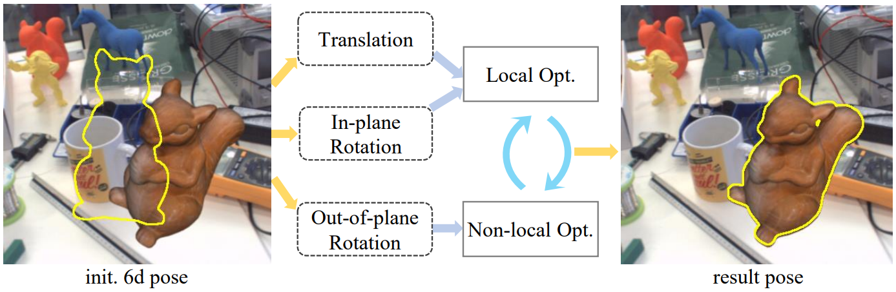
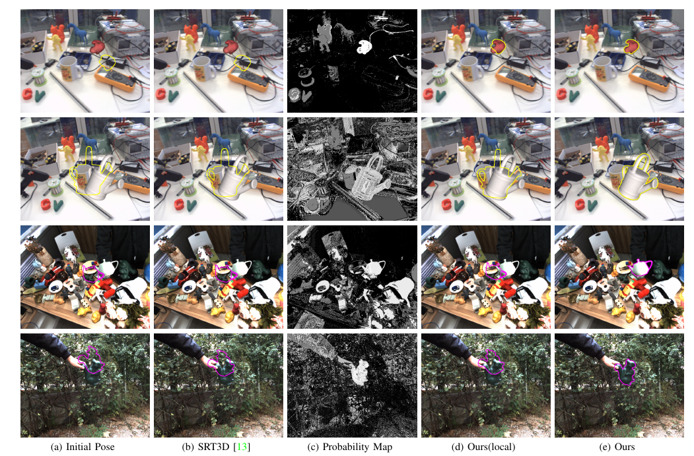

# Nonlocal 3D Object Tracking


The code for our paper "Large-displacement 3D Object Tracking with Hybrid Non-local Optimization, ECCV'2022"  and "LDT3D: Large-displacement 3D Object Tracking with Fast Hybrid Optimization".

LDT3D is an improved version of our ECCV method. The following contents are introduced based on LDT3D.

This repository is mainly for reproducing our main results in the paper. For a real-scene live demo, please see [BoxAR](https://github.com/cvbubbles/BoxAR).

## Introduction



Optimization-based 3D Object tracking is precise and fast, but it is known to be sensitive to large inter-frame displacements due to the local minimum of the objective function. 

We propose a hybrid approach combining non-local and local optimization , resulting in efficient non-local search in the 6D pose space. The main contributions are as follows:

- A precomputed robust contour-based tracking method is proposed for the pose optimization. By using long search lines with multiple candidate correspondences, it can adapt to different frame displacements without the need of coarse-to-fine search. 
- A non-local optimization that can run in real time without re-searching the contour correspondences.

Our method outperforms all previous methods for both small and large displacements. For large displacements, the accuracy is greatly improved. At the same time, real-time speed can be achieved with only CPU.

## Results

The average tracking accuracy for different frame step $S$ on RBOT dataset:

| Mehtod | Acc. of Frame step=1 | Acc. of Frame step=2 | Acc. of Frame step=3 | Acc. of Frame step=4 |
| :----: | :------------------: | :------------------: | :------------------: | :------------------: |
|  RBOT  |         79.9         |         44.6         |         13.5         |         2.5          |
|  RBGT  |         90.0         |         65.4         |         30.2         |         12.6         |
| SRT3D  |         94.2         |         76.9         |         43.5         |         19.4         |
| LDT3D  |         95.4         |         92.0         |         88.4         |         82.8         |

In the experiments on BCOT dataset involves more evaluation metrics. The details can be found in our paper.

Here are some visual examples:



## Installation

The code is developed with VS2019, and can be easily ported to linux.

It depends on **OpenCV 3.4.13, Assimp 5.01 and FreeGLUT 3.00**

The repository [cvf](https://github.com/cvbubbles/cvf) is used in our code.

A detailed use guideline will coming soon...

## Usage

The `exec` commands in `main.cpp` provide different evaluations.

- `exec("trackers.test_accuracy")` is used for testing a single sequence.
- `exec("trackers.test_accuracy_all")` is used for testing all sequences in RBOT dataset.
- `exec("trackers.test_on_bcot")` is used for testing all sequences in BCOT dataset.

There are some parameters in our method and the corresponding variables are in the file `tracker_***.h`. Here we provides the correspondences between them. If you would like to change the values, you can search them in the `.h` file. The detailed parameter effects can be found in our paper.

- $alpha$ : The `alpha` variable in `Templates::pro1`.
- $M$: The `MAX_POINTS_PER_LINE` variable in `struct Optimizer`.
- $N$: The `nSamples` variable in `Templates::build`.
- $D$: The `N` in  `computeScanLines`.

## Dataset

We evaluate our methods with the RBOT dataset and BCOT dataset. The datasets can be downloaded at:

- RBOT: [http://cvmr.mi.hs-rm.de/research/RBOT/](http://cvmr.mi.hs-rm.de/research/RBOT/)
- BCOT: [https://ar3dv.github.io/BCOT-Benchmark/](https://ar3dv.github.io/BCOT-Benchmark/)

## Citation

```tex
@inproceedings{huang2022rife,
  title={Large-displacement 3D Object Tracking with Hybrid Non-local Optimization},
  author={Tian, Xuhui and Lin, Xinran and Zhong, Fan and Qin, Xueying},
  booktitle={Proceedings of the European Conference on Computer Vision (ECCV)},
  year={2022}
}
```

